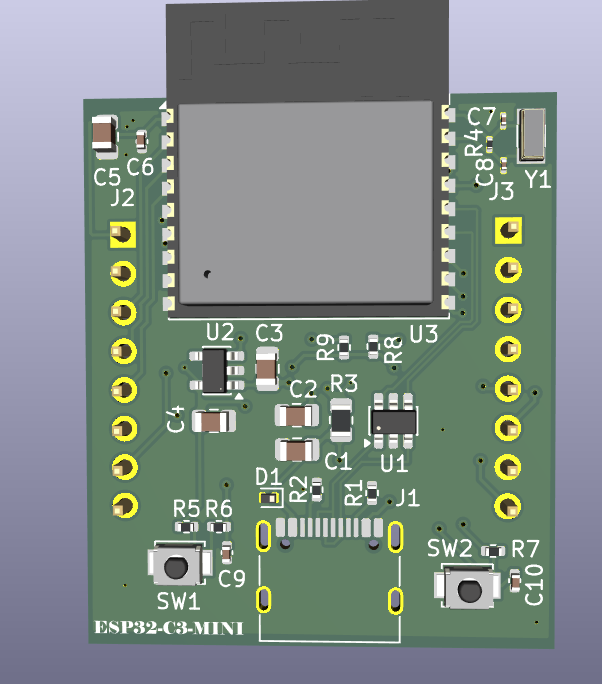
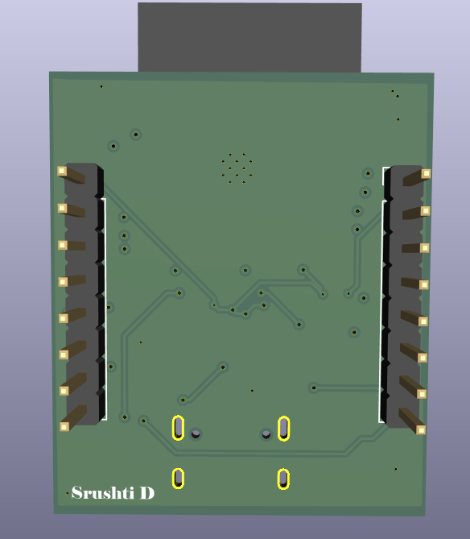
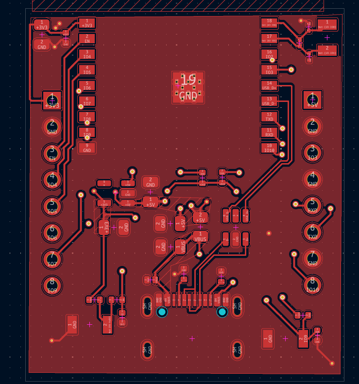
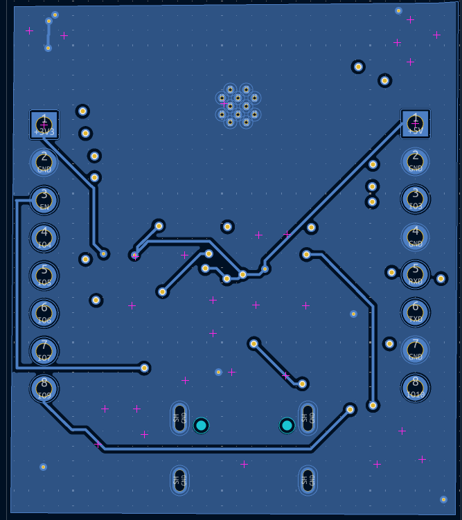

# ESP32-C3-WROOM-02 Development Board

A custom 4-layer development board built around the ESP32-C3-WROOM-02 module, designed from schematic to PCB using KiCad 10. The board provides USB-C power and data connectivity, 3.3 V regulation, boot/reset controls, and GPIO expansion through headers.

---
## Overview

The board includes:

- ESP32-C3-WROOM-02 module
- USB-C power and data interface
- 3.3 V regulated power supply
- Boot and Reset buttons
- GPIO expansion headers
- External crystal oscillator
- USB ESD protection
- 4-layer PCB with internal GND planes

---
## Features

- ESP32-C3-WROOM-02 module
- USB-C power and USB data interface
- USB-UART interface
- 3.3 V LDO power supply
- Dual-stage USB ESD protection
- Boot and Reset buttons
- GPIO expansion headers
- External crystal oscillator
- Power supply decoupling and filtering
- 4-layer PCB with dedicated internal GND planes
- Custom PCB layout and routing
- DRC validated with 0 violations

---
## Software Used

- [KiCad 10](https://www.kicad.org/)

---
## Hardware Architecture

The design is divided into the following functional blocks:

- Input Power & USB-C
  - USB-C receptacle
  - USB power input
  - USB data lines
  - Dual-stage ESD protection (USBLC6-2SC6 + PESD5V0L1UL)
  - CC resistors
  - Power filtering
- 3.3 V Power Supply
  - AP2112K-3.3 LDO
  - Input/output capacitors
  - 3.3 V supply for the ESP32-C3
- ESP32-C3-WROOM-02
  - ESP32-C3-WROOM-02 module
  - Decoupling capacitors
  - External crystal
  - EN and GPIO connections
- Boot & Reset 
  - Boot button
  - Reset button
  - Pull-up and RC components
- Pin Headers 
  - GPIO breakout
  - Power connections
  - UART connections

---
## Schematic

---
## PCB Design

### 3D Front View

### 3D Back View

### Front Copper Routing

### Back Copper Routing

---
## PCB Specifications

| Parameter Value  |                    |
| ---------------- | ------------------ |
| PCB Layers       | 4                  |
| Board Size       | \~30.58 × 35.83 mm |
| PCB Thickness    | 1.0 mm             |
| Design Tool      | KiCad 10           |
| Main Controller  | ESP32-C3-WROOM-02  |
| Logic Voltage    | 3.3 V              |
| USB Interface    | USB-C              |
| Power Regulator  | AP2112K-3.3        |

---
## Main Components

- ESP32-C3-WROOM-02
- AP2112K-3.3 LDO
- USB-C connector
- USB-UART interface IC
- USBLC6-2SC6 (USB ESD protection)
- PESD5V0L1UL (ESD protection diode)
- Crystal oscillator
- Push buttons (Boot, Reset)
- GPIO headers
- Decoupling and filtering capacitors
- Pull-up and configuration resistors

---
## Learning Outcomes

Building this board gave me hands-on experience with:

- Multi-layer (4-layer) PCB design and stackup planning
- Schematic design and functional block partitioning
- USB-C power and data interface design
- ESD protection and signal integrity considerations
- Power supply and decoupling design
- Design Rule Checks (DRC) and routing validation

---
## Future Improvements

- Add auto-reset circuitry (DTR/RTS) for one-click flashing instead of manual Boot/Reset buttons
- Add power and status indicator LEDs
- Explore a smaller board footprint / castellated edge for module-style reuse
- Add a battery charging circuit for portable/battery-powered use
- Confirm and document the exact crystal frequency once the BOM is finalized

---
## License

This project is licensed under the MIT License — see the [LICENSE](https://claude.ai/chat/LICENSE) file for details.

---

## Author

**Srushti D Hebbar** [GitHub](https://github.com/Srushti-D-Hebbar)
